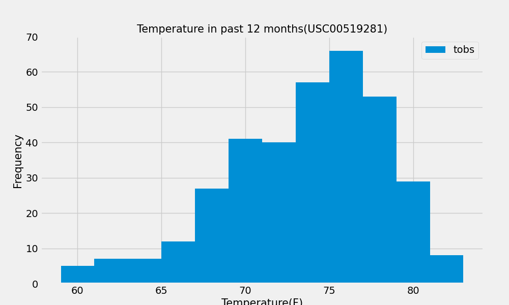

# sqlalchemy-challenge

# Content
A series of analysis on the vacation place in Honolulu, Hawaii were performed in this practice. Three folders are included in this repository:

Folder 1 - SurfsUp containing a file of climate_starter.ipynb, and app.py

Folder 2 - Output containing graph images 

Folder 3 - Resouces containing raw data

# Analysis 

Part 1: Analysis and Exploration of the Climate Data in the file of climate_starter.ipynb including 1a precipitation analysis and station analysis
Python and SQLAlchemy were applied to this analysis inlucing SQLAlchemy ORM queries, Pandas, and Matplotlib. Several functions were learned including using SQLAlchemy create_engine() function to connect to the SQLite database; SQLAlchemy automap_base() function to reflect the tables into classes, and then save references to the classes named station and measurement; Linking Python to the database by creating a SQLAlchemy session.

Section 1 Precipitation Analysis instructions: 

1.1. Find the most recent date in the dataset.

1.2. Using that date, get the previous 12 months of precipitation data by querying the previous 12 months of data.

1.3. Load the query results into a Pandas DataFrame. Explicitly set the column names.

1.4. Sort the DataFrame values by "date".

1.5. Plot the results by using the DataFrame plot method, as the following images

1.5.1. A screenshot depicts the plot.

1.5.2. Use Pandas to print the summary statistics for the precipitation data.

Section 2 Station Analysis instruction: 

2.1. Design a query to calculate the total number of stations in the dataset.

2.2. Design a query to find the most-active stations (with the most rows) through two steps:

2.2.1. List the stations.

2.2.2. Observation counts in descending order.

2.3. Design a query that calculates the lowest, highest, and average temperatures that filters on the most-active station id found in the previous query.

2.4. Design a query to get the previous 12 months of temperature observation (TOBS) data through two steps:

2.4.1. Filter by the station that has the greatest number of observations.

2.4.2. Query the previous 12 months of TOBS data for that station.

2.5. Plot the results as a histogram with bins=12, as the following image:

2.5.1. A screenshot depicts the histogram.

Close the session at the end of analysis

Part 2: Design a Climate App
A Flask API was designed based on the queries that was just developed. The routes were created by using Flask as follows:

1. Start at the homepage.

List all the available routes.

2. /api/v1.0/precipitation

Convert the query results from the precipitation analysis to a dictionary using date as the key and prcp as the value.

Return the JSON representation of the dictionary.

3. /api/v1.0/stations

Return a JSON list of stations from the dataset.

4. /api/v1.0/tobs
5. 
Query the dates and temperature observations of the most-active station for the previous year of data.

Return a JSON list of temperature observations for the previous year.

5. /api/v1.0/<start> and /api/v1.0/<start>/<end>

Return a JSON list of the minimum temperature, the average temperature, and the maximum temperature for a specified start or start-end range.

For a specified start, calculate TMIN, TAVG, and TMAX for all the dates greater than or equal to the start date.

For a specified start date and end date, calculate TMIN, TAVG, and TMAX for the dates from the start date to the end date, inclusive.

Use the Flask jsonify function to convert the API data to a valid JSON response object.

